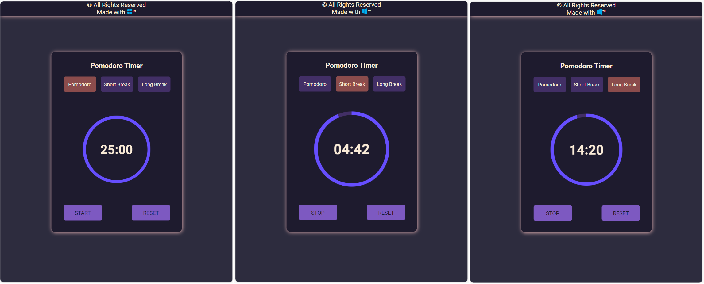

<h1 align="center"> Pomodoro Timer </h1>

  

  

## 💻 Project

Pomodoro Timer with alarm, includes 5min short brake and 15min long break.

▷ [Access the finished project](https://vitalinx7.github.io/pomodoro-timer/)

## 🛠️ Technologies

This project was developed with:

- HTML, CSS
- JavaScript
- Git e Github

---

 Made with &trade;
